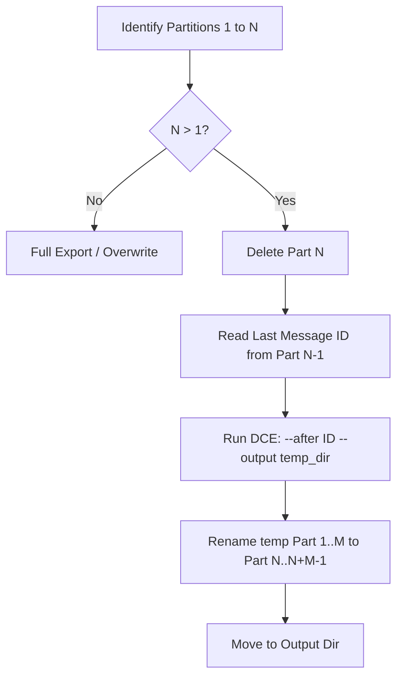

# Architecture Documentation

This document describes the internal structure and logic of `discord-incremental-backup`.

## System Overview
The system acts as an orchestrator for **DiscordChatExporter (DCE)**. It manages the discovery of channels/threads and implements a custom incremental logic to overcome the limitations of simple message exports when dealing with large, partitioned archives.

## Core Components

### 1. Discovery Phase (`discord.py-self`)
Uses a self-bot client to:
- Crawl configured **Category IDs**.
- Recursively find all **Text Channels** within those categories.
- Fetch **Archived Threads** and **Forum Posts** which are often missed by standard export tools.
- Cache discovered IDs in `channel_ids.txt` to maintain a persistent list of targets.

### 2. Incremental Logic & Partitioning
DCE exports messages in partitions (default: 1000 messages per file). This script manages these partitions to ensure backups are resume-able without duplicates or gaps.

#### The "Tail-Drop" Strategy
To ensure a clean resume point, the script assumes the very last partition in an archive might be incomplete.

- **State Detection**: It parses filenames using regex (`rf"^(.*\[{channel_id}\])(?: \[part (\d+)\])?.*\.json$"`).
- **Stitching**: Newly exported partitions from `/output_temp` are renamed and moved back to `/output`, starting from the dropped index `N`, creating a seamless sequence.

### 3. Media Portability (Path Normalization)
DCE often uses absolute paths or inconsistent relative paths for media depending on the execution context.
- The `normalize_json_paths` function post-processes every exported JSON file.
- It recursively traverses the JSON tree and replaces absolute media references with relative paths pointing to `output/media/`.
- This ensures the backup remains functional when moved between machines or viewed via `DiscordChatExporter-frontend`.

## Data Flow
1. **Config Load**: Read `token`, `categories`, and `excluded_channels` from `config.json`.
2. **Discord Login**: Discover channels and threads using `discord.py-self`.
3. **Looping**: For each channel:
    - Check if the `last_message_id` in the local archive matches the live channel's latest message.
    - If out of sync, calculate the resume point (Tail-Drop).
    - Execute `DiscordChatExporter.Cli` via `asyncio.create_subprocess_exec`.
    - Post-process JSON (rename parts + normalize paths).
4. **Cleanup**: Clear `output_temp` for the next run to prevent cross-channel contamination.

## Directory Structure
- `dce/`: Contains the `DiscordChatExporter.Cli` binary.
- `output/`: The permanent archive. Contains JSON partitions and the `media/` subfolder.
- `output_temp/`: A staging area used during incremental exports to prevent corruption of the main archive if a process is interrupted.
- `channel_ids.txt`: A simple line-separated list of IDs to ensure the script remembers discovered threads even if they aren't in the current discovery crawl.
